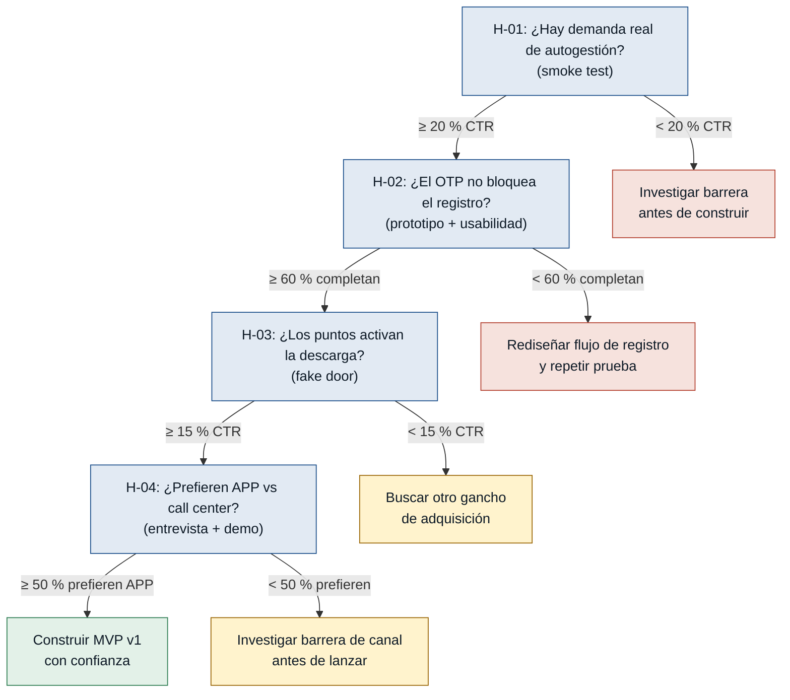
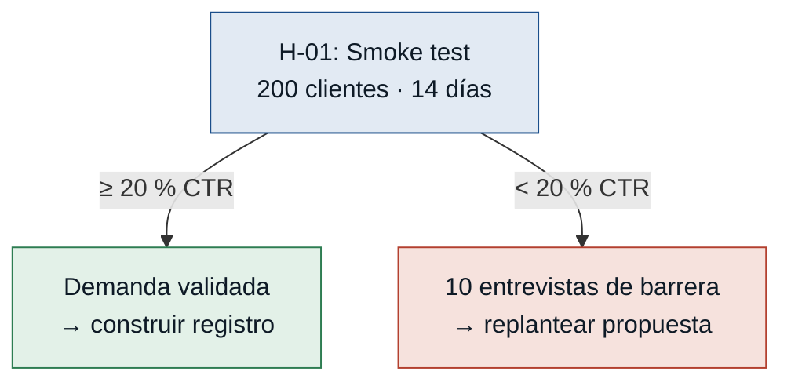
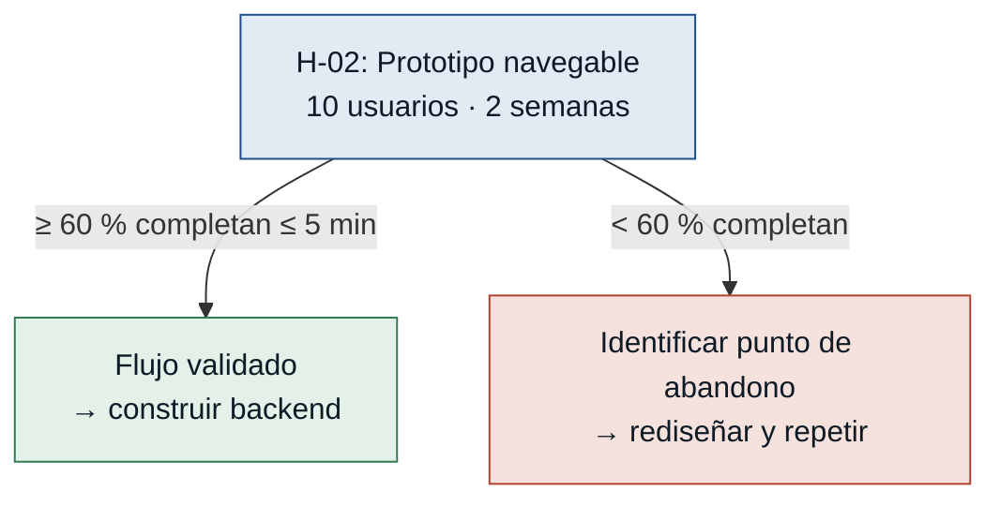
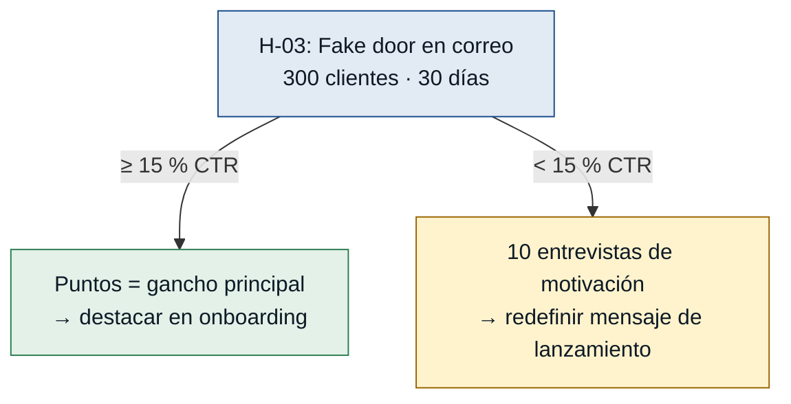
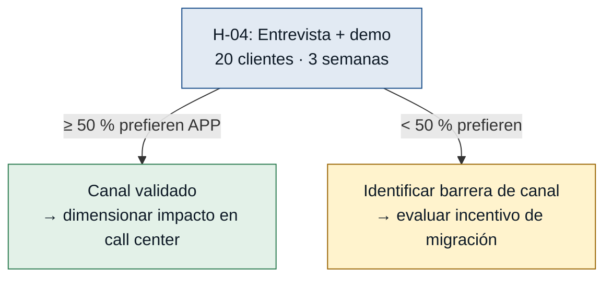

# Hipótesis y experimentos — APP Resuelve

> **Discovery:** `resuelve` · **Fecha:** 2026-06-23
> **Ordenadas de mayor a menor riesgo.** Probar en este orden: el supuesto más
> alto puede tumbar el MVP completo antes de gastar en los demás.

---

## Árbol de decisión general

---

### [H-01] Demanda real de autogestión digital — riesgo: **alto**

- **Supuesto a probar:** Los clientes de Resuelve tienen suficiente demanda de
  autogestión digital para descargar y usar una APP en lugar de llamar al call
  center. Sin este supuesto, la métrica de autogestión del 30 % nunca arranca.
- **Hipótesis:** Creemos que al menos el 20 % de los clientes activos de Resuelve
  harán clic en un llamado a la acción de descarga de la APP si reciben el anuncio
  por correo/SMS, porque la necesidad de ver su estado de cuenta y canjear puntos
  sin llamar es un dolor real y frecuente.
- **Señal medible:** Tasa de clic (CTR) en el botón de descarga/registro de una
  landing page enviada a la base activa (comportamiento real, no declaración).
- **Criterio de éxito:** ≥ 20 % de CTR sobre una muestra de 200 clientes activos
  en los primeros 14 días desde el envío.
- **Experimento:** *Smoke test / landing page* — crear una página estática que
  describe las funciones de la APP (registro, cuenta, puntos) sin construir el
  backend, y enviarla por correo y SMS a 200 clientes activos. Registrar cuántos
  hacen clic en el CTA de descarga o registro.
- **Caja de tiempo/costo:** 3 días de diseño de la landing + 14 días de observación.
  Costo estimado: diseño y envío de correos/SMS (< USD 200).
- **Regla de decisión:**
  - Si pasa (≥ 20 % CTR) → demanda validada; comenzar el primer sprint con el
    flujo de registro.
  - Si falla (< 20 % CTR) → no construir nada; realizar 10 entrevistas para
    entender la barrera (mensaje, beneficio, canal) y replantear antes de invertir
    en desarrollo.

---

### [H-02] Completitud del registro con OTP — riesgo: **alto**

- **Supuesto a probar:** El flujo de registro en 3 pasos (datos → OTP → contraseña)
  tiene una tasa de completitud suficientemente alta para no bloquear la adopción.
  Si el OTP no llega o los usuarios abandonan, nadie puede usar la APP.
- **Hipótesis:** Creemos que ≥ 60 % de los clientes nuevos que inicien el registro
  lo completarán (incluyendo la validación OTP y la creación de contraseña) sin
  asistencia y en ≤ 5 minutos, porque el flujo en 3 pasos es simple y el OTP
  llega al correo en tiempo.
- **Señal medible:** Tasa de completitud del flujo de registro: usuarios que
  finalizan la creación de contraseña / usuarios que inician el ingreso de datos
  personales. Mide la fricción real del onboarding, no una intención.
- **Criterio de éxito:** ≥ 60 % de los participantes completan el flujo sin
  asistencia en ≤ 5 minutos, en sesión de prueba con prototipo navegable sobre
  10 usuarios reales.
- **Experimento:** *Prototipo navegable + sesiones de usabilidad* — construir el
  flujo de registro en Figma/InVision (con OTP simulado de 6 dígitos) y hacer 10
  sesiones de prueba con clientes reales. Medir tasa de completitud, tiempo por
  paso y punto exacto de abandono.
- **Caja de tiempo/costo:** 1 semana de diseño del prototipo + 1 semana de
  sesiones. Costo estimado: tiempo de diseño UX + incentivos para participantes
  (< USD 500).
- **Regla de decisión:**
  - Si pasa (≥ 60 % sin asistencia) → construir el flujo de registro real con
    confianza en el diseño.
  - Si falla (< 60 %) → identificar el paso de abandono, rediseñar (TTL del OTP
    a 10 min, reenvío inmediato, reducir campos obligatorios) y repetir la prueba
    antes de comenzar el backend.

---

### [H-03] El programa de puntos como motivador de adopción — riesgo: **medio**

- **Supuesto a probar:** El programa de puntos acumulados es el motivador principal
  que llevará a los clientes a descargar y usar la APP. Si los puntos no generan
  suficiente tracción, hay que encontrar otro gancho de adquisición antes de lanzar.
- **Hipótesis:** Creemos que ≥ 15 % de los clientes activos con puntos acumulados
  harán clic en un enlace de canje incluido en su estado de cuenta mensual por
  correo, porque los puntos representan valor percibido no aprovechado que activa
  la intención de uso.
- **Señal medible:** Tasa de clic (CTR) en el botón "Canjea tus [X] puntos ahora"
  incluido en el correo de estado de cuenta mensual. Mide intención de canje real,
  no una declaración.
- **Criterio de éxito:** ≥ 15 % de CTR sobre 300 clientes activos con puntos
  acumulados en los primeros 30 días desde el envío del correo.
- **Experimento:** *Fake door* — en el correo de estado de cuenta mensual existente,
  agregar un botón prominente "Canjea tus [X] puntos ahora" que lleva a un
  formulario de pre-registro de interés (no al canje real). Medir el CTR sobre
  la base activa con puntos.
- **Caja de tiempo/costo:** 2-3 días de implementación del bloque en el correo +
  30 días de observación. Costo estimado: tiempo de desarrollo de la plantilla de
  correo (< USD 100).
- **Regla de decisión:**
  - Si pasa (≥ 15 % CTR) → los puntos son el gancho de adquisición; destacarlos
    como beneficio #1 en el onboarding y en la campaña de lanzamiento de la APP.
  - Si falla (< 15 % CTR) → los puntos solos no motivan la acción; realizar 10
    entrevistas para identificar qué beneficio sí activa la descarga (ahorro de
    tiempo, notificaciones de pago, etc.) antes de definir el mensaje de lanzamiento.

---

### [H-04] Preferencia de la APP sobre el call center — riesgo: **medio**

- **Supuesto a probar:** Los clientes activos que hoy llaman al call center para
  consultas de saldo preferirían usar la APP si estuviera disponible. Sin este
  supuesto, el outcome de desplazamiento del call center no se cumple.
- **Hipótesis:** Creemos que ≥ 50 % de los clientes que actualmente llaman para
  consultas de saldo declararán preferencia por usar una APP en lugar de llamar,
  si se les muestra una demo de 2 minutos del flujo de consulta de cuenta, porque
  el autoservicio elimina el tiempo de espera en la línea.
- **Señal medible:** Porcentaje de entrevistados que declaran preferencia por la
  APP sobre el call center para consultas rutinarias de saldo y movimientos, tras
  ver la demo del prototipo.
- **Criterio de éxito:** ≥ 50 % de preferencia declarada sobre una muestra de
  20 clientes entrevistados en un plazo de 3 semanas.
- **Experimento:** *Entrevista dirigida con demo* — contactar a 20 clientes que
  hayan llamado al call center en el último mes para consultas de saldo. Mostrarles
  el prototipo navegable del dashboard (estado de cuenta + movimientos) y preguntar
  directamente si preferirían usar la APP para esa consulta en el futuro. Registrar
  las barreras mencionadas por quienes no prefieren la APP.
- **Caja de tiempo/costo:** 3 semanas (1 de coordinación + 2 de entrevistas).
  Costo estimado: tiempo del entrevistador + acceso al prototipo (< USD 300).
- **Regla de decisión:**
  - Si pasa (≥ 50 % prefieren APP) → el canal APP es viable para migrar consultas
    de rutina; usar este dato para dimensionar el impacto en call center y como
    argumento del pitch de inversión.
  - Si falla (< 50 %) → identificar la barrera específica (desconfianza digital,
    hábito del call center, dispositivo no compatible, falta de incentivo) y evaluar
    si hay que ofrecer un incentivo de migración o reorientar el segmento objetivo
    antes de lanzar.

