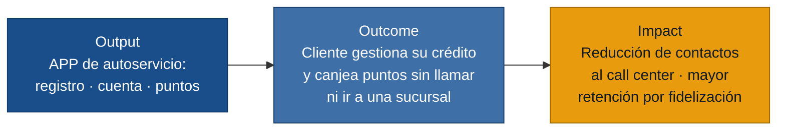

# MVP Canvas — APP Resuelve

> **Discovery:** `resuelve` · **Fecha:** 2026-06-23
> **Persona central:** Cliente de tarjeta Resuelve (respaldo de primera mano)

---

## Cadena de valor: output → outcome → impact

---

## Canvas

| Bloque | Contenido |
|---|---|
| **Propuesta de valor** | Dar al cliente de tarjeta Resuelve una APP de autoservicio donde pueda registrarse, consultar su estado de cuenta y canjear puntos en minutos, sin necesidad de llamar al call center ni visitar una sucursal. |
| **Segmento de usuarios** | Cliente activo o pre-aprobado de tarjeta Resuelve: tanto quien se registra por primera vez como quien ya tiene crédito y quiere autogestión digital. |
| **Funcionalidades mínimas** | 1. Verificación de cédula + registro (OTP + contraseña) + login. 2. Dashboard con estado de cuenta (cuota al cobro, cuota consumida, fecha de pago) e historial de movimientos. 3. Consulta de saldo de puntos + catálogo + flujo de canje completo (elegibilidad → dirección → confirmación). 4. Perfil (ver datos, cambiar contraseña, cerrar sesión). |
| **Resultado esperado (outcome)** | El cliente completa al menos una autogestión (consulta o canje) desde la APP en lugar de llamar al call center o ir a una sucursal. |
| **Métrica de éxito** | Porcentaje de clientes activos que realizan al menos 1 autogestión mensual (consulta de estado de cuenta o canje de puntos) vía APP, medido en los primeros 60 días tras el lanzamiento. **Meta: ≥ 30 % de la base activa.** |
| **Riesgos / supuestos** | A) Los clientes prefieren la APP al call center para consultas de rutina. B) La tasa de completitud del registro con OTP es ≥ 60 %. C) La base de clientes en sistemas de Resuelve está disponible en tiempo real para la verificación de cédula. D) Los puntos acumulados son suficiente motivación para descargar y usar la APP. |
| **Fuera de alcance (por ahora)** | · Autenticación biométrica (Face ID / huella) — agrega complejidad sin ser bloqueante para el valor central. · Gamificación y premios por pago puntual (gráficos de progreso, modales de celebración) — segunda ola. · Notificaciones push de vencimiento — segunda ola. · Splash screen animado con video de marca — cosmético, no probatorio de valor. · Personalización del modelo visual de tarjeta — cosmético. · Administración del banner desde back-office — requiere entrevista de primera mano del administrador de negocio (persona actualmente `referenciada`). · Eliminación de cuenta — edge case de muy baja frecuencia en el MVP. |

---

## Prueba ácida de la métrica

**¿Si la métrica sube, alguien del negocio puede tomar una decisión diferente?**

Sí: si el % de autogestión mensual supera el 30 %, Resuelve puede decidir
reducir el dimensionamiento del call center, incluir más funcionalidades en la
siguiente iteración de la APP o ampliar el programa de puntos. Si no supera el
umbral, se activa un pivote (investigar la fricción en el flujo de registro o
en el canje) antes de seguir invirtiendo.

---

## Supuestos más riesgosos (para experimentos)

1. **(riesgo alto)** Los clientes descubrirán y adoptarán la APP sin un plan de
   activación activo — sin esto, la métrica de autogestión nunca arranca.
2. **(riesgo alto)** La tasa de completitud del registro con OTP es suficientemente
   alta — si el OTP no llega o expira, los usuarios abandonen antes de ingresar.
3. **(riesgo medio)** Los puntos acumulados son motivación suficiente para
   que el cliente descargue y use la APP — si los puntos no tienen valor percibido,
   el canje no tracciona.
4. **(riesgo medio)** Los clientes activos prefieren la APP al call center para
   consultas de rutina — si el hábito ya está establecido en el canal telefónico,
   la adopción digital será lenta.

> Estos supuestos deben convertirse en hipótesis falsables antes del desarrollo.
> Ejecutar `/discovery:experiments discoveries/resuelve`.
