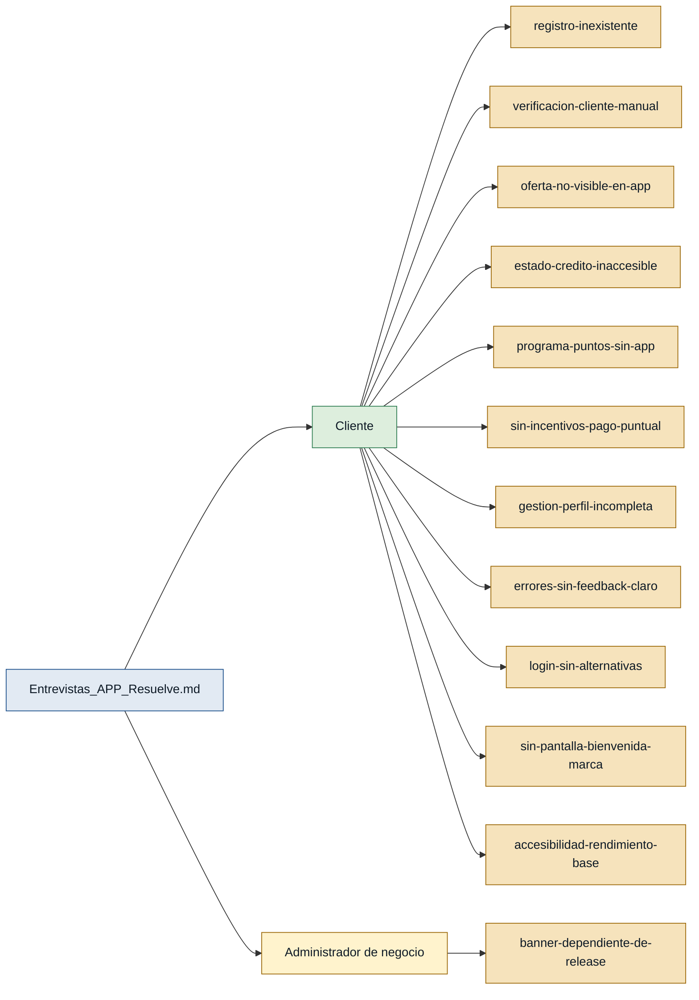

# Personas y Stakeholders — Discovery Resuelve

> **Fuente de evidencia:** `Entrevistas_APP_Resuelve.md` (única entrevista disponible).
>
> **Advertencia de calidad:** el archivo de entrevistas fue generado a partir del backlog
> de la APP, no de sesiones de usuario independientes. Las respuestas al dolor son
> idénticas en las 39 "entrevistas" (`"simple, rápida y segura"`), lo que indica una
> formulación plantillada. Los dolores específicos se han extraído de las respuestas
> a "¿Qué necesidad tienes?" de cada story. Esta limitación debe tenerse en cuenta
> antes de generar el MVP.

---

## Mapa de trazabilidad

---

## Personas

### Cliente — usuario de la tarjeta de crédito Resuelve

- **Contexto:** Persona natural que posee o solicita una línea de crédito con la tarjeta Resuelve; quiere gestionar su cuenta, pagos y puntos desde su celular.
- **Objetivo principal:** Tener una APP de autoservicio donde pueda ver su estado de cuenta, pagar, canjear puntos y manejar su perfil sin necesidad de llamar o ir a una sucursal.
- **Dolores:**
  - No existe flujo de registro en la APP; el cliente no puede crear cuenta. (Entrevistas_APP_Resuelve.md — US-007, US-008, US-009, US-010, US-011)
  - No puede verificar si es cliente Resuelve al ingresar su cédula. (Entrevistas_APP_Resuelve.md — US-002)
  - El cliente pre-aprobado no puede ver su oferta ni continuar la solicitud desde la APP. (Entrevistas_APP_Resuelve.md — US-003)
  - No hay visibilidad del estado de solicitud, LDC inactiva ni estado de cuenta. (Entrevistas_APP_Resuelve.md — US-005, US-006, US-016, US-018, US-021)
  - No puede ver saldo, historial ni canjear puntos de fidelidad desde la APP. (Entrevistas_APP_Resuelve.md — US-022, US-023, US-024, US-025, US-026, US-027, US-028, US-029, US-030, US-031)
  - No hay incentivos ni notificaciones que motiven el pago puntual. (Entrevistas_APP_Resuelve.md — US-019, US-020, US-037)
  - No puede gestionar su perfil: ver datos, cambiar contraseña ni eliminar cuenta. (Entrevistas_APP_Resuelve.md — US-032, US-033, US-034)
  - Los errores de registro, sesión expirada y falta de conectividad no tienen mensajes claros. (Entrevistas_APP_Resuelve.md — US-011, US-035, US-036)
  - No existe autenticación biométrica (Face ID / huella) ni recuperación de contraseña. (Entrevistas_APP_Resuelve.md — US-013, US-014)
  - No hay pantalla de bienvenida con identidad de marca al descargar la APP. (Entrevistas_APP_Resuelve.md — US-001)
  - La APP no garantiza accesibilidad ni rendimiento base para todos los dispositivos. (Entrevistas_APP_Resuelve.md — US-039)
- **Respaldo:** `primera mano` — `Entrevistas_APP_Resuelve.md` con frontmatter `rol_entrevistado: cliente` y `primera_persona: true`.

---

### Administrador de negocio — operador del back-office Resuelve

- **Contexto:** Miembro del equipo de Resuelve encargado de gestionar contenidos y configuraciones de la APP desde el back-office, sin depender de una publicación en tiendas.
- **Objetivo principal:** Actualizar el banner promocional de la APP de forma autónoma y sin generar una nueva versión.
- **Dolores:**
  - No puede actualizar el banner de la APP sin publicar una nueva versión. (Entrevistas_APP_Resuelve.md — US-038)
- **Respaldo:** `referenciada` — el rol aparece mencionado en US-038 dentro del archivo `Entrevistas_APP_Resuelve.md`, cuyo frontmatter registra `rol_entrevistado: cliente`, no `administrador`. **No existe entrevista de primera mano de este rol.**

> ⚠️ **Persona sin respaldo de primera mano.** El Administrador de negocio no puede
> sustentar historias de usuario ni bloques del MVP hasta contar con una entrevista
> propia de ese rol (`primera_persona: true`).

---

## Stakeholders

### Resuelve (empresa emisora del crédito)

- **Interés en el sistema:** Aumentar el uso de la tarjeta Resuelve mediante una APP de autoservicio que mejore la experiencia del cliente, reduzca la carga operativa en call center y refuerce el programa de fidelización.
- **Fuente:** implícito en la totalidad de las entrevistas de `Entrevistas_APP_Resuelve.md`.
